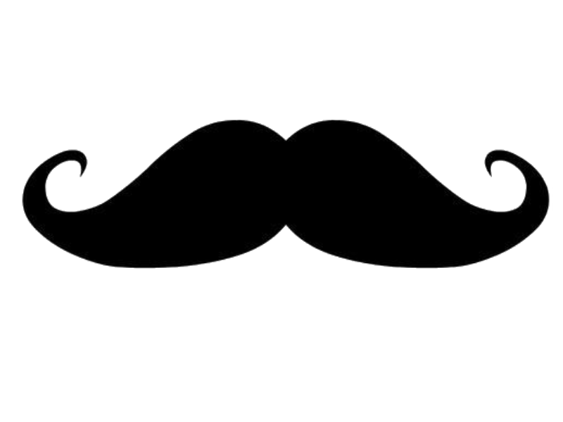

MoustacheUML
============

Un Modeleur UML permettant de créer des diagrammes de classe et des diagrammes d'objet

Coding style
------------

* On utilise en général les **[standards Sun/Oracle](http://www.oracle.com/technetwork/java/javase/documentation/codeconvtoc-136057.html)**.

* Utilisation des **SmartTab** : **indentation** avec **tabulations**, **alignement** avec **espaces**.

* Une ligne ne doit **jamais** finir par un espace/tabulation.

* **Pas de fin de ligne en CRLF**, on utilise uniquement **LF**. Mettez la valeur '**core.autocrlf**' à '**true**' dans votre config Git.

* **Pas de limite de lignes de code à 80 caractères**. On essayera autant que possible de **ne pas faire de longue ligne de code**. Les commentaires **Javadoc** sont **limités à 78 caractères** par ligne.

* Tout code **doit être documenté** (JavaDoc) autant que possible.
    
* Il **doit** y avoir un retour à la ligne à **chaque** fin de fichier.

* Le code sera autant que possible en **Français**. Commentaires, JavaDoc, noms de variables et de classes...
